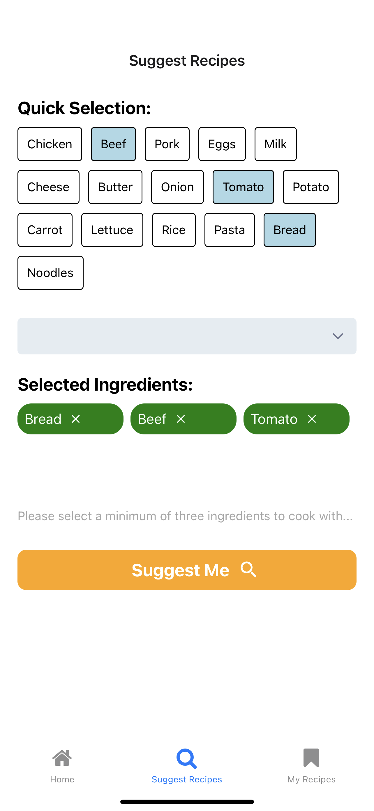

# FoodFindr

FoodFindr is an app to help you find easy meals to prepare to save you the headache of coming up with recipes yourself using OpenAI and Edamam APIs. You'll be given all the instructions needed to prepare the meal along with all the nutrition information to help with your meal planning.

<h1></h1>

 This is the home screen of FoodFindr. You can move over to the suggest page and select a minimum of 3 ingredients as the base of your recipe from the quick selection or search tab. <em>Note that what the app actually suggests can include more ingredients than the ones you select.</em> 

  
  

 Once finished loading, you will be able to see a picture of the meal along with all the information that you will need to create the meal itself. 

  

 If you see any recipe you like or want to save it for later, you can bookmark and view it in 'My Recipes'. 

  
  

